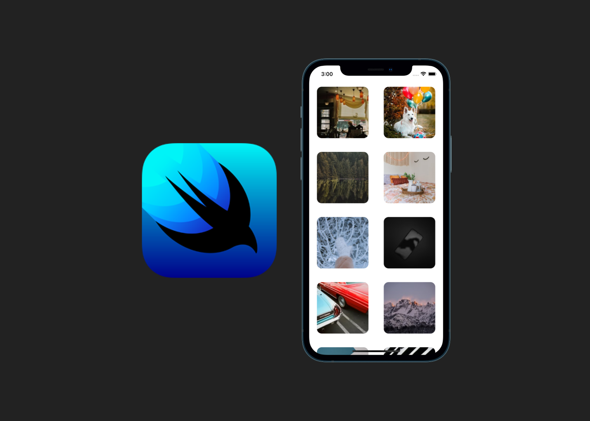

This a is simple example on how to implement a SwiftUI LazyVGrid 
to display images using Unsplash APIs and the SDWebImageSwiftUI framework. 
To get started:

1. Download the porject
2. Get your API Key at https://unsplash.com/developers
3. Paste the Key in the pictureViewModel.swift file 
4. Run your porject 

Here is the final result:

